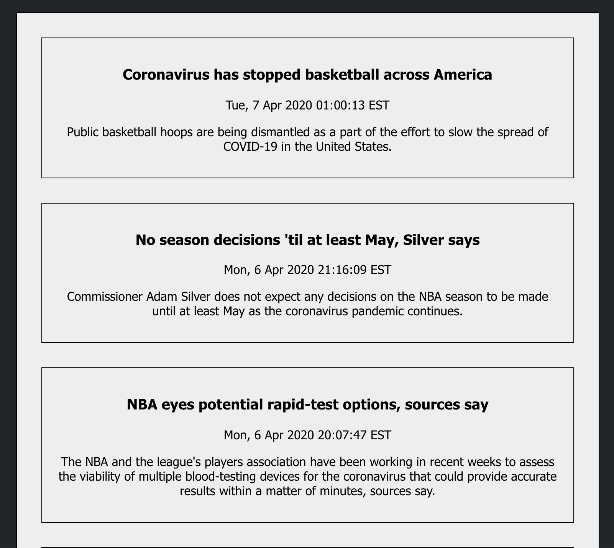
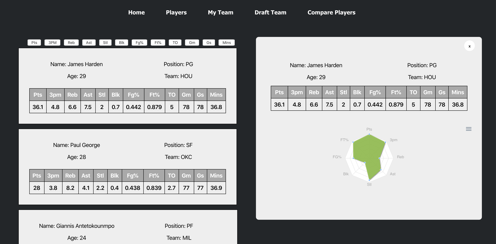
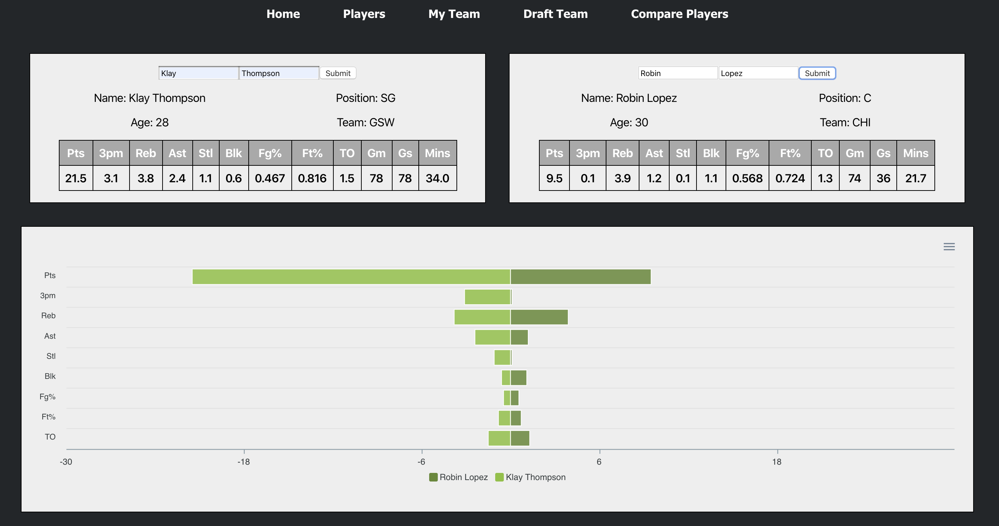

# FB Finesse 

FB Finesse is a web application that allows users draft and manager their fantasy basketball teams. It was built using a SQLite database, Python back end, Flask web framework, and a front end made with React and Javascript. This project is under development and features will be continually added.

## Features

<h4> News Feed </h4>

  - Live news feed helps user stay up-to-date on the latest NBA news right on the homepage. The RSS feed links the user directly to the ESPN article
 

<h4> Data Visualization </h4>

 - Used ApexCharts.js to visualize data received from the Flask API
 
 - Radar charts easily display a players statistics against all other players in the league
 
 - Bar charts help compare two players side-by-side

<h4> Player Statistics </h4>
  
  - Every active NBA player and their statistics from the 2018-2019 NBA season and the statistical categories relevant to fantasy basketball. Sort by statistical category and quickly scroll through each player to find their Radar Chart

<h4> Draft Your Team </h4>
 
  - Draft players to your team and save them to your user account

<h4> Evaluate Your Team </h4>

  - Look at all of the players statistics on your team to evaluate your team's strengths and weaknesses

<h4> Player Comparison </h4>

  - Compare two players side-by-side in a bar chart to evaluate which player to draft

## Future Features
 
  - Image scraping - player portraits
  - Live Data
  - Player trends - hot/cold streaks
  - ML concepts - predictive data for upcoming games
  - Scoreboard
  - User trends

